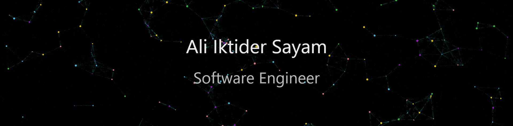

<!---

--->

  

  

## Hi there 👋, I'm Ali Iktider Sayam

I am a software engineer with strong technical proficiency and a strong work history in Full Stack Web Development and Cross Platform Mobile Application Development.

Find out more about me & feel free to connect with me:

 &nbsp; &nbsp;  &nbsp; &nbsp;  &nbsp; &nbsp;  &nbsp; &nbsp;  &nbsp; &nbsp;   

## ⚡ Technologies

- 🔭 I’m currently working on Growing My Tech Start-Up
- 🌱 I’m currently learning Three.js
- 👯 I’m looking to collaborate on Flutter, Laravel, MERN and ThreeJS 
- 🤔 I’m looking for help with ThreeJS
- 💬 Ask me about Anything 
- ⚡ Fun fact: I might be a musician too 

<a href="https://www.aisayam.com/"><!-- wi*quL3fcV --></a>

  

## Find My Online Resume <a href="https://aisayam.com/">HERE</a>
